  I build reliable backend &amp; systems teams can depend on — across <b>TypeScript</b>, <b>Rust</b> &amp; <b>Go</b>.

  <a href="https://www.linkedin.com/in/luccin-masirika">LinkedIn</a> &nbsp;·&nbsp;
  <a href="https://luccinmasirika.com">Portfolio</a> &nbsp;·&nbsp;
  <a href="mailto:luccinmasirika@gmail.com">Email</a> &nbsp;·&nbsp;
  <a href="https://x.com/luccinmasirika">X</a>

  
  &nbsp;
  
  &nbsp;
  

---

### What I do

- **Backend &amp; APIs** — Node.js · NestJS · Prisma · PostgreSQL
- **Systems &amp; performance** — Rust · Tokio · WebAssembly
- **Fullstack product** — TypeScript · React · Next.js

### Tech

### Open source

Code merged into two of the largest projects in their ecosystems.

<!-- OSS:START -->

- **12.3k ★** &nbsp; [caddyserver/caddy](https://github.com/caddyserver/caddy) &nbsp;`Go` 
  Repeated `hide` subdirectives now append instead of overwriting — [#7817](https://github.com/caddyserver/caddy/pull/7817), merged.
- **71.5k ★** &nbsp; [rtk-ai/rtk](https://github.com/rtk-ai/rtk) &nbsp;`Rust` 
  Cargo JSON diagnostics across build, check, test & clippy — [#2422](https://github.com/rtk-ai/rtk/pull/2422), merged.

<!-- OSS:END -->

Also — <a href="https://github.com/caddyserver/website/pull/545">caddy/website #545</a> (approved) &nbsp;·&nbsp; <a href="https://github.com/rtk-ai/rtk/pull/2417">rtk #2417</a> (open)

### Featured

- **[s3rsync](https://github.com/luccinmasirika/s3rsync)** — streaming S3↔S3 copier, 2.1–2.4× rclone on small objects &nbsp;`Rust`
- **[sweep](https://github.com/luccinmasirika/sweep)** — safe, interactive disk cleanup for macOS, Homebrew tap &nbsp;`Rust`
- **[kora-sync](https://github.com/luccinmasirika/kora-sync)** — streams system audio to AirPlay devices &nbsp;`Rust`

📍 Kigali, Rwanda &nbsp;·&nbsp; open to interesting backend &amp; systems problems
